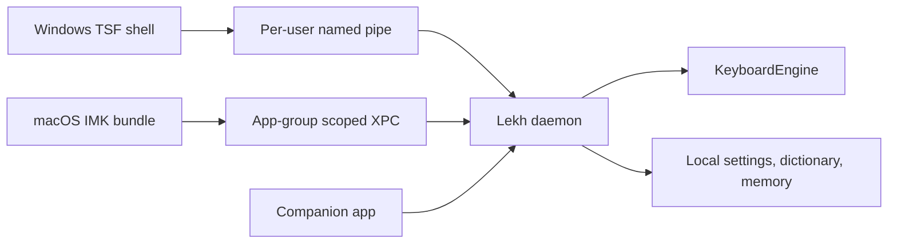

# Lekh Keyboard Final Architecture

Lekh Keyboard is keyboard-first. Preeti remains a side utility for companion/document tools, not the core typing path.

## Current Repo-Executable System

- `KeyboardEngine` session API.
- Romanized live typing.
- Romanized helper suggestions and labels.
- Traditional Unicode suggestions with physical layout audit pending.
- Proofread while typing.
- Dictionary lookup without unsafe meaning data.
- Local correction memory.
- Keyboard Lab browser simulation.
- Typing-session benchmarks.
- Native IPC, daemon, TSF, IMK, companion, storage, packaging, and release scaffolds.

## Production Native Shape

## Companion Is Not The IME

The companion app manages settings, diagnostics, privacy, dictionary, memory, layout preview, and document utilities. It is not a hot keystroke handler and must not be implemented as a global keyboard hook.

## Native Requirements

- Windows native IME requires TSF.
- macOS native IME requires InputMethodKit and XPC.
- Production release requires platform testing, signing, notarization, installer QA, and pilot feedback.

## Rust Port Policy

Rust is profiling-guided future work. It is not a prerequisite unless measured latency or memory profiles prove the TypeScript daemon cannot meet the native hot-path target.
