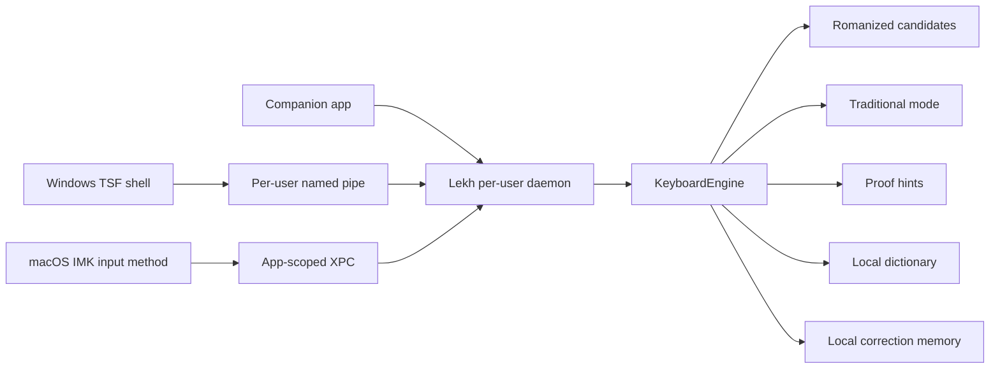

# Lekh Keyboard Production Architecture

Generated: 2026-05-27

Lekh Keyboard is keyboard-first. The browser app and Keyboard Lab validate the engine, but the product target is a native Windows/macOS Nepali desktop keyboard.

## Product Boundary

Core product:

- Romanized Nepali keyboard mode.
- Traditional Nepali keyboard mode after source-of-truth layout audit.
- Romanized to Nepali Unicode candidates.
- Romanized helper spellings and optional labels.
- Traditional Unicode suggestions and proofread hints.
- Dictionary lookup without unsafe meaning data.
- Personal correction memory.
- Local-first privacy.
- Native Windows/macOS input methods.
- Per-user daemon/service.
- Companion app for settings, diagnostics, memory, dictionary, and document tools.

Side utility:

- Preeti to Unicode converter for legacy documents.

Deferred:

- advanced mixed-document repair;
- cloud sync;
- mobile keyboard;
- OCR;
- voice input;
- LLM rewriting;
- enterprise dashboard.

## Runtime Architecture

## Native Shell Responsibilities

Windows TSF shell:

- receive key events through TSF;
- start/update/cancel composition;
- display candidate UI;
- commit selected text;
- pass through safely if daemon/IPC is unavailable;
- avoid engine logic beyond marshaling and fail-open behavior.

macOS IMK shell:

- receive key events through `IMKInputController`;
- manage marked text;
- show candidates through `IMKCandidates` first;
- commit selected text;
- communicate through XPC;
- pass through safely if XPC is unavailable.

## Daemon Responsibilities

- host and warm the shared `KeyboardEngine`;
- own session lifecycle;
- serve local IPC requests;
- own local dictionary and memory storage adapters;
- expose redacted diagnostics;
- never send typed text to the network.

## Companion App Responsibilities

The companion app is not the IME and not the hot keystroke handler.

It owns:

- settings;
- mode selection;
- Romanized and Traditional preferences;
- layout preview;
- dictionary and personal dictionary management;
- correction memory reset/export/import;
- privacy controls;
- daemon status and diagnostics;
- Preeti side utility/document tools;
- update/about pages.

## Safety Invariants

- No hidden telemetry.
- No network in the hot typing path.
- Secure/password/code fields disable or reduce suggestions and memory.
- Unknown or unsafe input should preserve/pass through, warn, or ask for candidates instead of silently corrupting text.
- Traditional physical layout must remain pending until audited.
- Native production release requires real TSF/IMK tests, signing/notarization, installer tests, and pilot feedback.

## Current Repo-Executable Status

- `KeyboardEngine` exists and is tested.
- Keyboard Lab validates sessions in browser.
- Native TSF/IMK scaffolds and docs exist.
- IPC schema and message types exist.
- Daemon lifecycle is documented.
- Production release is not complete.
